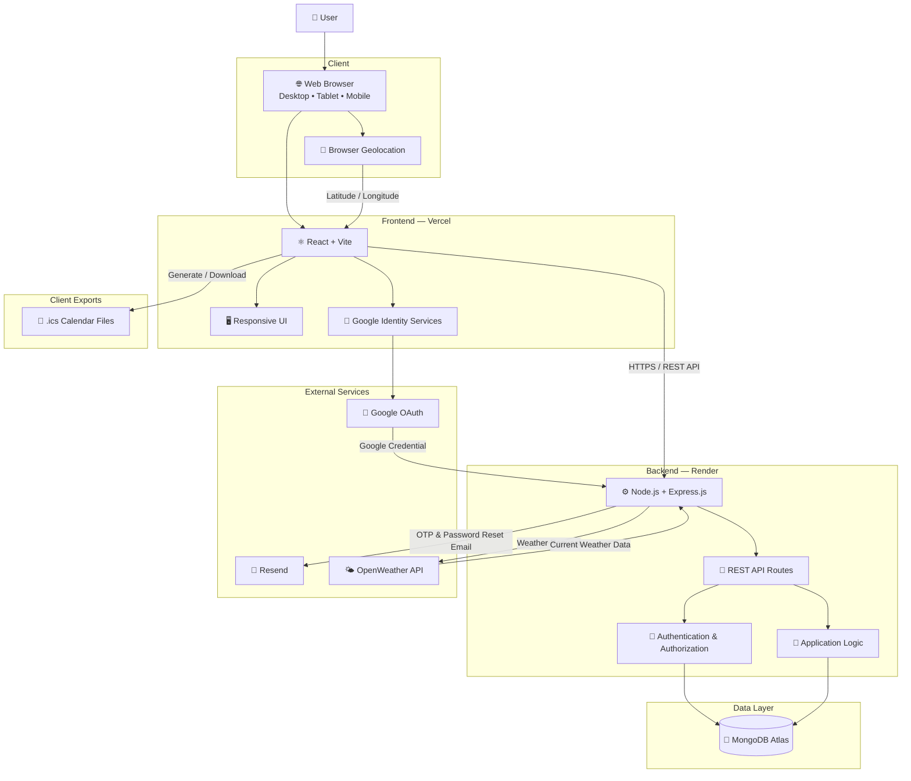
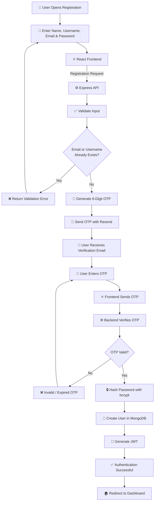
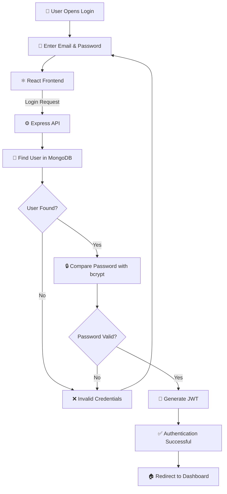
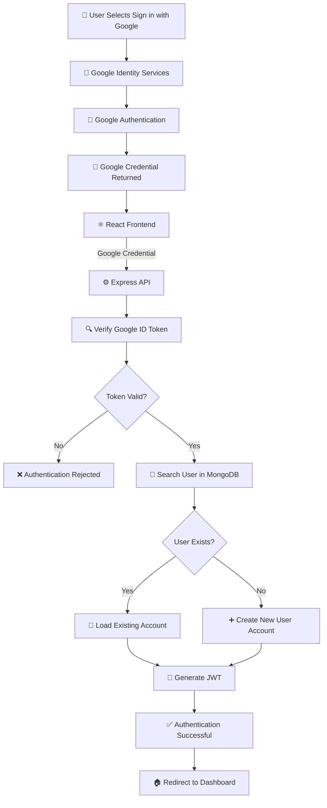
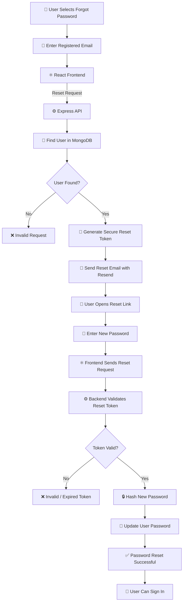
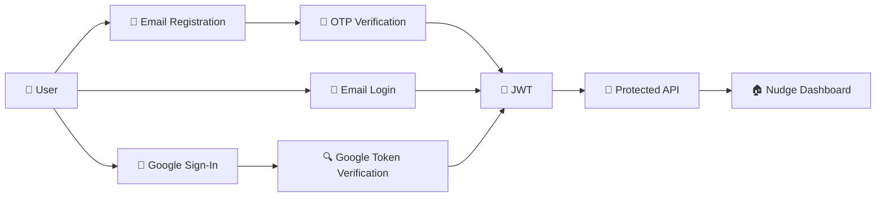
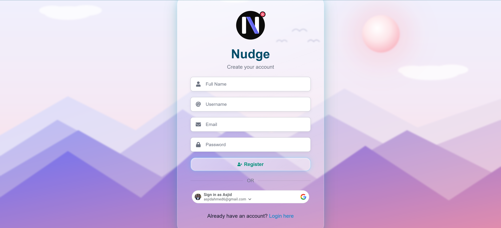

<div align="center">


# Nudge

### Remember Everything. Focus on What Matters.

**A full-stack productivity web application built with the MERN stack.**

<br/>

<a href="https://nudgere.com">
  
</a>

<a href="https://github.com/frost64/Nudge-JS">
  
</a>

<br/><br/>


</div>

---

## 📌 About Nudge

**Nudge** is a full-stack productivity web application designed to help users organize everyday information from one centralized dashboard.

Users can manage:

- ⏰ Reminders
- 📝 Notes
- 🎂 Birthdays
- 🔗 Saved links
- 👤 Personal information

The application also includes:

- Google authentication
- Email verification
- Password recovery
- Global search
- Weather information
- Calendar export
- Profile customization
- Light and dark themes
- Responsive desktop and mobile layouts

Nudge was developed as a complete production-ready **MERN application** and deployed using modern cloud services.

### 🌐 Live Application

**[https://nudgere.com](https://nudgere.com)**

---

## ✨ Features

### 🔐 Authentication

- User registration
- Email verification
- 6-digit OTP verification
- Email and password login
- Google Sign-In / Google OAuth
- JWT-based authentication
- Protected API routes
- Forgot password functionality
- Secure password reset
- Password hashing using bcrypt
- Duplicate email validation
- Duplicate username validation
- Server-side input validation

### 🏠 Dashboard

- Personalized user greeting
- Responsive statistics overview
- Total reminders
- Total notes
- Total birthdays
- Total saved links
- Pending reminders
- Overdue reminders
- Upcoming birthdays
- Favorite links
- Quick-access actions
- Current weather information

### 🌤️ Weather

- Browser geolocation support
- Current temperature
- "Feels like" temperature
- Current location
- Weather condition icon
- Automatic fallback location

If browser geolocation is unavailable or denied, Nudge falls back to:

**Islamabad, Pakistan**

### ⏰ Reminders

Users can:

- Create reminders
- Edit reminders
- Delete reminders
- Mark reminders as completed
- Mark reminders as pending
- Set reminder dates
- Set reminder times
- Set priority levels
- Assign categories
- View overdue reminders
- View pending reminders
- Track overdue days
- Export reminders as `.ics` calendar files
- Open reminders directly from dashboard and search results

### 📝 Notes

Users can:

- Create notes
- Edit notes
- Delete notes
- Add tags
- Organize personal information
- Pin important notes
- Favorite notes
- Search notes
- Export selected notes

### 🎂 Birthdays

Users can:

- Save birthdays
- Edit birthdays
- Delete birthdays
- View upcoming birthdays
- See remaining days until birthdays
- Access birthdays directly from the dashboard

### 🔗 Saved Links

Users can:

- Save useful links
- Edit saved links
- Delete saved links
- Favorite important links
- Access favorite links from the dashboard
- Search saved links

### 🔎 Global Search

Nudge provides application-wide search across:

- Reminders
- Notes
- Birthdays
- Saved links

Search results can take users directly to the corresponding item.

### 👤 Profile Management

Users can:

- Update full name
- Update username
- Update email address
- Change password
- Add or update a profile picture
- Edit profile information
- Delete their account

### 🎨 Themes

- Light theme
- Dark theme
- Theme preference stored per user

### 📱 Responsive Design

Nudge has been optimized for:

- Desktop browsers
- Laptops
- Tablets
- Android phones
- iPhones

Responsive handling includes:

- Navigation
- Forms
- Cards
- Modals
- Mobile layouts
- iOS date/time inputs
- Dynamic viewport heights
- Mobile browser safe areas
- Touch-based interfaces

---

## 🧰 Tech Stack

### 🎨 Frontend

<p>
  
  
  
  
  
  
  
</p>

### ⚙️ Backend

<p>
  
  
  
  
  
  
  
</p>

### 🗄️ Database

<p>
  
  
</p>

### 🔌 APIs & Integrations

<p>
  
  
  
  
  
</p>

### ☁️ Deployment

<p>
  
  
  
</p>

---

## 🏗️ Application Architecture

Nudge follows a client-server architecture with a React frontend, REST API backend, cloud-hosted MongoDB database, and external services for authentication, email, and weather data.



### Architecture Overview

- **Client:** Users access Nudge through desktop, tablet, and mobile browsers.
- **Frontend:** React and Vite provide the user interface and communicate with the backend through HTTPS REST API requests.
- **Backend:** Node.js and Express.js handle authentication, validation, application logic, and API routes.
- **Database:** MongoDB Atlas stores persistent application and user data.
- **Authentication:** JWT handles application sessions while Google Identity Services provides Google authentication.
- **Email:** Resend handles OTP verification and password recovery emails.
- **Weather:** OpenWeather provides current weather information using user location when available.
- **Calendar Export:** Reminder data can be exported as `.ics` files for compatible calendar applications.

---

## 🔐 Authentication Flow

Nudge supports multiple authentication paths, including email/password registration, standard login, Google authentication, and secure password recovery.

### 📝 Email Registration & Verification

New users must verify their email address using a 6-digit OTP before their account is fully created.



### 🔑 Email & Password Login

Existing users can authenticate using their registered email address and password.



### 🔵 Google Authentication

Google Sign-In uses Google Identity Services on the frontend and token verification on the backend.



### 🔄 Password Recovery

Users who forget their password can securely request a password reset.



### 🛡️ Authentication Security

The authentication system includes:

- 🔒 Password hashing using **bcrypt**
- 🎫 JWT-based authentication
- 🔐 Protected backend routes
- 🔵 Google ID token verification
- 📧 Email OTP verification
- 🔢 6-digit verification codes
- ⏳ Expiring verification and password-reset tokens
- ✅ Server-side request validation
- 🚫 Duplicate email and username protection
- 🔑 Secure password recovery
- 🌐 CORS restrictions
- 🚦 API rate limiting
- 🔐 Environment-based secret management

### 🔁 Authentication Overview



---

## 📁 Project Structure

A simplified representation of the application structure:

```text
Nudge-JS/
│
├── client/
│   ├── public/
│   │
│   ├── src/
│   │   ├── assets/
│   │   │   ├── backgrounds/
│   │   │   └── Logo.svg
│   │   │
│   │   ├── components/
│   │   ├── context/
│   │   ├── hooks/
│   │   ├── pages/
│   │   ├── services/
│   │   └── utils/
│   │
│   ├── .env.example
│   ├── package.json
│   └── vite.config.js
│
├── nudge/
│   ├── config/
│   ├── controllers/
│   ├── middleware/
│   ├── models/
│   ├── routes/
│   ├── utils/
│   ├── uploads/
│   ├── server.js
│   ├── .env.example
│   └── package.json
│
├── screenshots/
│
├── .gitignore
└── README.md
```

> The exact folder structure may change as the project evolves.

---

## 🔑 Environment Variables

Sensitive credentials should always be stored using environment variables.

> **Never commit real `.env` files, API keys, passwords, database credentials, tokens, or other secrets to GitHub.**

### Frontend Environment Variables

Create:

```text
client/.env
```

Example:

```env
VITE_API_URL=http://localhost:5000/api
VITE_GOOGLE_CLIENT_ID=your_google_client_id
```

For production, `VITE_API_URL` should point to the deployed backend.

### Backend Environment Variables

Create:

```text
nudge/.env
```

Example:

```env
MONGO_URI=your_mongodb_connection_string
JWT_SECRET=your_jwt_secret

GOOGLE_CLIENT_ID=your_google_client_id

RESEND_API_KEY=your_resend_api_key
EMAIL_FROM=Nudge <no-reply@your-domain.com>

FRONTEND_URL=http://localhost:5173
CORS_ORIGINS=http://localhost:5173

NODE_ENV=development
TRUST_PROXY=1
```

Do not add real production values to the repository.

---

## 📄 `.env.example`

Including example environment files makes local setup easier without exposing secrets.

### `client/.env.example`

```env
VITE_API_URL=
VITE_GOOGLE_CLIENT_ID=
```

### `nudge/.env.example`

```env
MONGO_URI=
JWT_SECRET=

GOOGLE_CLIENT_ID=

RESEND_API_KEY=
EMAIL_FROM=

FRONTEND_URL=
CORS_ORIGINS=

NODE_ENV=development
TRUST_PROXY=
```

---

# 🚀 Running Locally

## Prerequisites

Make sure you have the following installed:

- Node.js
- npm
- Git
- MongoDB Atlas account or a local MongoDB database

You will also need valid credentials for any external integrations you want to use, including:

- Google OAuth
- Resend
- OpenWeather

---

## 1️⃣ Clone the Repository

```bash
git clone https://github.com/frost64/Nudge-JS.git
```

Enter the project directory:

```bash
cd Nudge-JS
```

---

## 2️⃣ Start the Backend

Navigate to the backend directory:

```bash
cd nudge
```

Install dependencies:

```bash
npm install
```

Create your backend environment file:

```text
.env
```

Configure the required environment variables, then start the development server:

```bash
npm run dev
```

The backend normally runs at:

```text
http://localhost:5000
```

The REST API is available at:

```text
http://localhost:5000/api
```

---

## 3️⃣ Start the Frontend

Open another terminal from the repository root.

Navigate to the frontend:

```bash
cd client
```

Install dependencies:

```bash
npm install
```

Create:

```text
.env
```

Configure:

```env
VITE_API_URL=http://localhost:5000/api
VITE_GOOGLE_CLIENT_ID=your_google_client_id
```

Start the frontend development server:

```bash
npm run dev
```

The frontend normally runs at:

```text
http://localhost:5173
```

---

## ☁️ Production Deployment

### Frontend

The React frontend is deployed using **Vercel**.

**Production website:**

[https://nudgere.com](https://nudgere.com)

The frontend communicates with the backend using HTTPS REST API requests.

### Backend

The Node.js and Express backend is deployed using **Render**.

**Production API:**

```text
https://nudge-js.onrender.com
```

**API base URL:**

```text
https://nudge-js.onrender.com/api
```

### Database

Production application data is stored using **MongoDB Atlas**.

MongoDB Atlas provides:

- Cloud-hosted MongoDB
- Persistent application data
- Secure database access
- Production database availability

---

## 🌐 CORS

Production CORS configuration allows approved frontend origins to access the API.

Example:

```env
CORS_ORIGINS=https://nudgere.com,https://nudge-js.vercel.app,http://localhost:5173
```

The production frontend URL is configured separately:

```env
FRONTEND_URL=https://nudgere.com
```

---

## 🔑 Google OAuth Configuration

Google authentication uses a Google OAuth **Web Application Client**.

Authorized JavaScript origins include development and production origins such as:

```text
http://localhost:5173
https://nudge-js.vercel.app
https://nudgere.com
```

The same Google Web Client ID is configured on both the frontend and backend.

### Frontend

```env
VITE_GOOGLE_CLIENT_ID=
```

### Backend

```env
GOOGLE_CLIENT_ID=
```

---

## 📧 Email Verification

Nudge uses **Resend** for transactional email.

Email functionality includes:

- Registration OTP verification
- Password reset emails

The sender configuration uses:

```env
RESEND_API_KEY=
EMAIL_FROM=
```

A verified email domain should be used in production.

---

## 🌤️ Weather Integration

Nudge displays current local weather information on the dashboard.

When geolocation permission is granted:

```text
Browser Location
       ↓
Latitude / Longitude
       ↓
Backend Weather API
       ↓
Current Local Weather
```

If geolocation permission is denied or location information cannot be retrieved:

```text
Fallback Location
       ↓
Islamabad, Pakistan
       ↓
Weather API
```

---

## 📅 Calendar Export

Reminder information can be exported as `.ics` calendar files.

This enables users to add reminders to compatible calendar applications.

Exported information includes:

- Reminder title
- Reminder date
- Reminder time

---

## 🔒 Security

Nudge includes multiple application and API security measures.

### Authentication Security

- Password hashing using bcrypt
- JWT authentication
- Google ID token verification
- Protected routes
- Secure password-reset tokens
- OTP verification

### API Security

- CORS restrictions
- Rate limiting
- Request validation
- Server-side validation
- Environment-based secrets
- Error handling
- Authentication middleware

### User Data

Sensitive information such as passwords and private credentials is never intentionally exposed through frontend API responses.

---

## 📱 Responsive Design

The application was built and tested across multiple screen sizes.

### 🖥️ Desktop

- Full navigation
- Multi-column layouts
- Large dashboard cards
- Desktop forms and modals

### 💻 Tablet

- Adaptive grid layouts
- Responsive cards
- Tablet-friendly spacing

### 🤖 Android

- Mobile navigation
- Touch-friendly controls
- Responsive forms
- Mobile modal handling

### 🍎 iPhone / iOS

Additional handling was implemented for:

- Safari dynamic viewport behavior
- `100dvh` layouts
- Safe-area spacing
- Native date inputs
- Native time inputs
- Input width overflow
- Mobile form sizing

---

## 🖼️ Screenshots

### Login


---

### Register



---

### Dashboard


---

### Reminders


---

### Notes


---

### Birthdays


---

### Links


---

### Admin Dashboard


---

### Profile


---

### Mobile View


---

## 🧩 Key Development Challenges

Building Nudge involved solving several real-world development and deployment challenges:

- Configuring production CORS
- Connecting independently deployed frontend and backend services
- Configuring MongoDB Atlas for production
- Implementing JWT authentication
- Integrating Google OAuth
- Configuring Google Authorized JavaScript Origins
- Implementing email OTP verification
- Integrating Resend transactional email
- Managing environment variables across platforms
- Handling mobile and iOS browser differences
- Fixing Safari date/time input sizing
- Creating responsive layouts across multiple device types
- Managing mobile viewport heights
- Implementing secure password-reset flows
- Handling API errors and validation messages
- Configuring reverse-proxy behavior on Render
- Deploying and testing a complete MERN application in production

---

## 🎓 What I Learned

This project provided practical experience with the complete lifecycle of a modern full-stack application:

- Designing reusable React components
- Managing application state
- Building REST APIs
- Designing MongoDB schemas
- Authentication and authorization
- External API integration
- Email verification
- OAuth integration
- Responsive UI development
- Cross-browser debugging
- Mobile Safari debugging
- Production deployment
- DNS and domain configuration
- Environment management
- Debugging production logs
- Cloud-hosted databases
- Frontend/backend integration

---

## 🔮 Future Improvements

Potential future improvements include:

- Native Android application
- Native iOS application
- Push notifications
- Browser notifications
- Reminder notification scheduling
- Additional calendar integrations
- Recurring reminders
- Improved weather forecasts
- User-defined dashboard widgets
- Additional productivity integrations
- Progressive Web App support
- Offline functionality

---

## ✅ Development Status

- ✅ Frontend deployment
- ✅ Backend deployment
- ✅ MongoDB Atlas
- ✅ Custom domain
- ✅ JWT authentication
- ✅ Google authentication
- ✅ Email verification
- ✅ Password recovery
- ✅ Responsive desktop UI
- ✅ Tablet support
- ✅ Android support
- ✅ iPhone / Safari support
- ✅ Weather integration
- ✅ Calendar export
- ✅ Global search

---

## 🔗 Project Links

| Resource | Link |
| --- | --- |
| 🌐 Live Application | [nudgere.com](https://nudgere.com) |
| ▲ Frontend Deployment | [nudge-js.vercel.app](https://nudge-js.vercel.app) |
| ⚙️ Backend API | [nudge-js.onrender.com](https://nudge-js.onrender.com) |
| 💻 GitHub Repository | [github.com/frost64/Nudge-JS](https://github.com/frost64/Nudge-JS) |
| 🔗 LinkedIn | [Asjid Ahmed](https://www.linkedin.com/in/asjidahmed/) |

---

## 🛡️ Repository Safety

Before publishing or sharing the repository, make sure the following are **never committed**:

- `.env`
- `.env.local`
- `.env.production`
- MongoDB credentials
- JWT secrets
- Google client secrets
- Resend API keys
- Other private API keys or credentials

Your `.gitignore` should include environment files.

Example:

```gitignore
.env
.env.*
!.env.example

node_modules/
dist/
uploads/
```

> Be careful with `uploads/` if the repository intentionally contains static files that are required by the application.

---

## 🤝 Contributing

This project is currently maintained as a personal portfolio project.

Suggestions, feedback, and constructive contributions are welcome through GitHub issues.

---

## 📄 License

This project was developed as a portfolio and full-stack web development project.

Unless a separate license file is included in the repository, all rights are reserved by the project author.

---

## 👨‍💻 Author

**Asjid Ahmed**

Full-Stack Developer • Data Scientist

<div align="center">

### Let's Connect

<a href="mailto:asjidahmed6@gmail.com">
  
</a>

<a href="https://www.linkedin.com/in/asjidahmed/">
  
</a>

<a href="https://github.com/frost64">
  
</a>

<br/><br/>

### Nudge

**Remember Everything. Focus on What Matters.**

<sub>Built with React • Node.js • Express • MongoDB</sub>

</div>