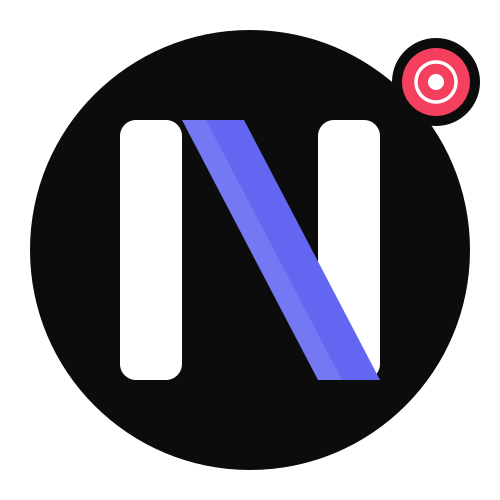
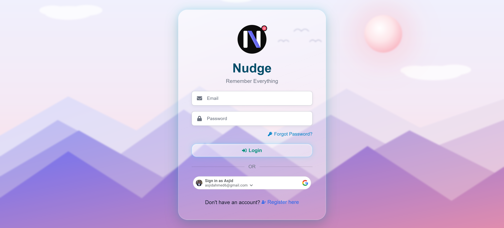
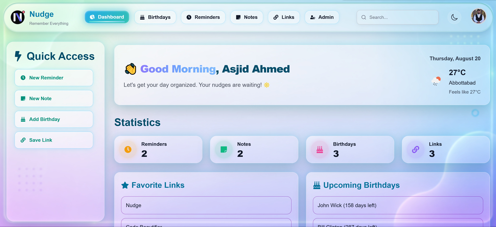
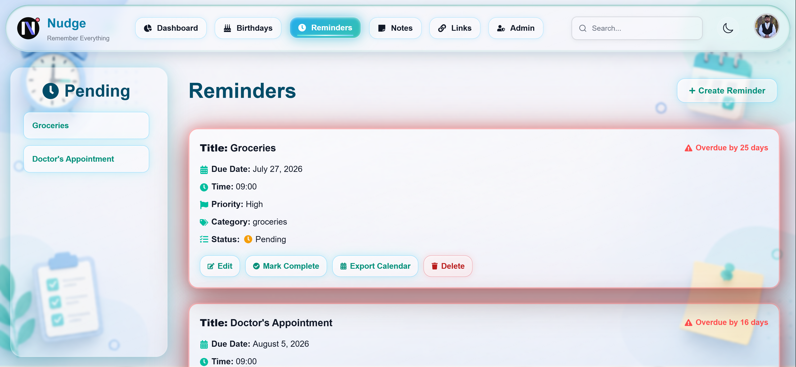
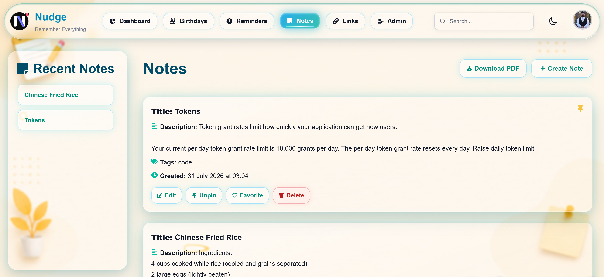
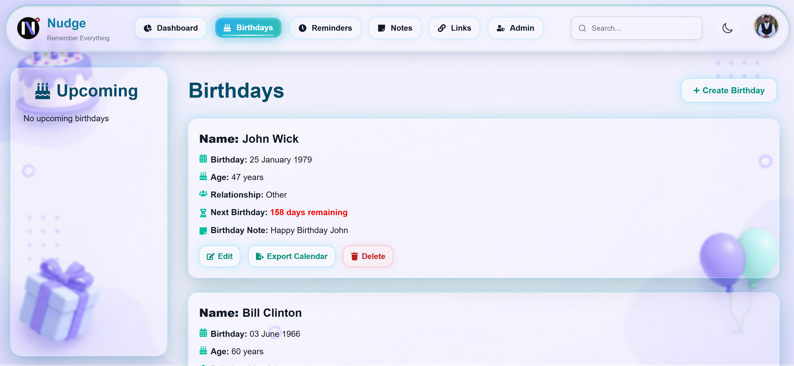
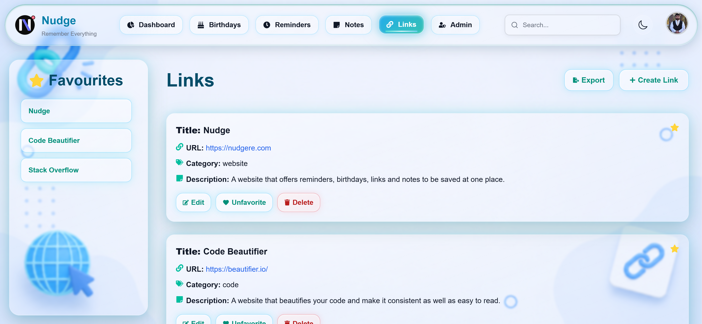
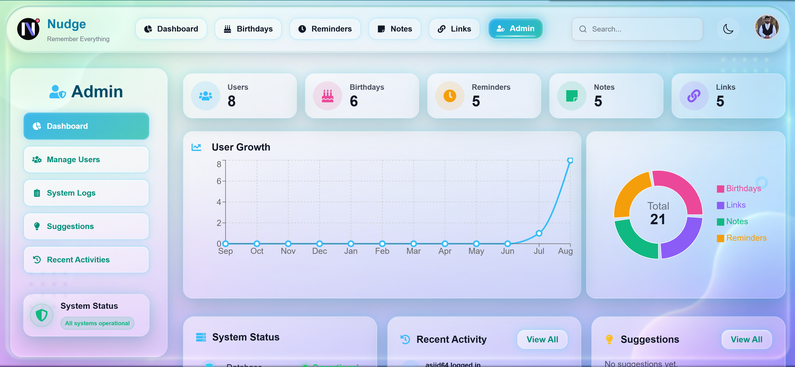
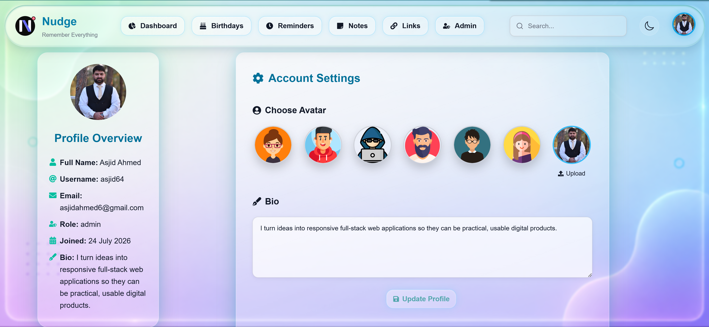
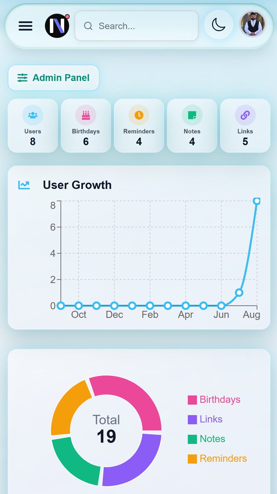

# Nudge

<p align="center">
  
</p>

<p align="center">
  <strong>Remember Everything. Focus on What Matters.</strong>
</p>

<p align="center">
  A full-stack productivity web application built with the MERN stack.
</p>

<p align="center">
  <a href="https://nudgere.com"><strong>Live Demo</strong></a>
  ·
  <a href="#features"><strong>Features</strong></a>
  ·
  <a href="#running-locally"><strong>Run Locally</strong></a>
</p>

---

## About Nudge

**Nudge** is a full-stack productivity web application designed to help users organize their everyday information from one centralized dashboard.

Users can manage reminders, notes, birthdays, saved links, and personal information while also benefiting from features such as Google authentication, email verification, password recovery, global search, weather information, calendar export, profile customization, and responsive layouts.

The application was built as a complete production-ready MERN project and deployed using modern cloud services.

### Live Application

**https://nudgere.com**

---

## Features

### Authentication

- User registration with email verification
- 6-digit OTP verification
- Email and password login
- Google Sign-In / Google OAuth
- JWT-based authentication
- Protected API routes
- Forgot password functionality
- Secure password reset
- Password hashing using bcrypt
- Duplicate email validation
- Duplicate username validation
- Server-side input validation

### Dashboard

- Personalized user greeting
- Responsive statistics overview
- Total reminders
- Total notes
- Total birthdays
- Total saved links
- Pending reminders
- Overdue reminders
- Upcoming birthdays
- Favorite links
- Quick-access actions
- Weather information

### Weather

- Uses browser geolocation when permission is granted
- Displays current temperature
- Displays "feels like" temperature
- Displays location
- Displays current weather icon
- Falls back to **Islamabad, Pakistan** if browser location is unavailable or denied

### Reminders

Users can:

- Create reminders
- Edit reminders
- Delete reminders
- Mark reminders as completed
- Mark reminders as pending
- Set reminder date
- Set reminder time
- Set priority
- Assign categories
- View overdue reminders
- View pending reminders
- Track overdue days
- Export reminders as `.ics` calendar files
- Open reminders directly from dashboard/search results

### Notes

Users can:

- Create notes
- Edit notes
- Delete notes
- Add tags
- Organize personal information
- Pin important notes
- Favorite notes
- Search notes
- Export selected notes

### Birthdays

Users can:

- Save birthdays
- Edit birthdays
- Delete birthdays
- View upcoming birthdays
- See remaining days until birthdays
- Quickly access birthdays from the dashboard

### Links

Users can:

- Save useful links
- Edit saved links
- Delete saved links
- Favorite important links
- Quickly access favorite links from the dashboard
- Search saved links

### Global Search

Nudge provides application-wide search across:

- Reminders
- Notes
- Birthdays
- Saved links

Search results can take the user directly to the corresponding item.

### Profile Management

Users can:

- Update full name
- Update username
- Update email address
- Change password
- Add or update profile picture
- Edit profile information
- Delete their account

### Themes

- Light theme
- Dark theme
- Theme preference stored per user

### Responsive Design

Nudge has been optimized for:

- Desktop browsers
- Laptops
- Tablets
- Android phones
- iPhones

The application includes responsive handling for:

- Navigation
- Forms
- Cards
- Modals
- Mobile layouts
- iOS date/time inputs
- Dynamic viewport heights
- Mobile browser safe areas
- Touch-based interfaces

---

## Tech Stack

### Frontend

- React
- Vite
- React Router
- Axios
- React Context API
- React Hot Toast
- React Icons
- Google Identity Services

### Backend

- Node.js
- Express.js
- MongoDB
- Mongoose
- JSON Web Tokens
- bcrypt / bcryptjs
- Express Validator
- Multer
- Google Auth Library

### APIs & Integrations

- Google OAuth / Google Identity Services
- OpenWeather API
- Resend Email API
- Calendar `.ics` export

### Deployment

- **Frontend:** Vercel
- **Backend:** Render
- **Database:** MongoDB Atlas
- **Domain:** Custom production domain

---

## Application Architecture

```text
                    ┌──────────────────────┐
                    │      User Browser    │
                    │ Desktop / Mobile     │
                    └──────────┬───────────┘
                               │
                               │ HTTPS
                               ▼
                    ┌──────────────────────┐
                    │    React + Vite      │
                    │       Frontend       │
                    │       Vercel         │
                    └──────────┬───────────┘
                               │
                               │ REST API
                               ▼
                    ┌──────────────────────┐
                    │ Node.js + Express.js │
                    │       Backend        │
                    │       Render         │
                    └──────────┬───────────┘
                               │
                               ▼
                    ┌──────────────────────┐
                    │    MongoDB Atlas     │
                    │      Database        │
                    └──────────────────────┘

External Services
────────────────────────────────────────────

Google Identity Services  → Authentication
Resend                    → Email / OTP
OpenWeather               → Weather
Calendar Export           → .ics files
```

---

## Authentication Flow

### Standard Registration

```text
User enters registration details
            ↓
Frontend sends registration request
            ↓
Backend validates user information
            ↓
Checks email and username availability
            ↓
Generates OTP
            ↓
OTP sent using Resend
            ↓
User enters OTP
            ↓
Backend verifies OTP
            ↓
User account created
            ↓
JWT generated
            ↓
User redirected to Dashboard
```

### Google Authentication

```text
User selects Sign in with Google
            ↓
Google Identity Services
            ↓
Google credential returned to frontend
            ↓
Credential sent to backend
            ↓
Backend verifies Google token
            ↓
Existing user logged in
        OR
New user created
            ↓
JWT generated
            ↓
User redirected to Dashboard
```

---

## Project Structure

A simplified structure of the application:

```text
project-root/
│
├── client/
│   ├── public/
│   │
│   ├── src/
│   │   ├── assets/
│   │   │   ├── backgrounds/
│   │   │   └── Logo.svg
│   │   │
│   │   ├── components/
│   │   ├── context/
│   │   ├── hooks/
│   │   ├── pages/
│   │   ├── services/
│   │   └── utils/
│   │
│   ├── .env.example
│   ├── package.json
│   └── vite.config.js
│
├── nudge/
│   ├── config/
│   ├── controllers/
│   ├── middleware/
│   ├── models/
│   ├── routes/
│   ├── utils/
│   ├── uploads/
│   ├── server.js
│   ├── .env.example
│   └── package.json
│
├── screenshots/
│
├── .gitignore
└── README.md
```

Your exact folder structure may differ slightly depending on the repository organization.

---

## Environment Variables

Sensitive credentials should always be stored using environment variables.

**Never commit real `.env` files, API keys, passwords, database credentials, or secrets to GitHub.**

---

### Frontend Environment Variables

Create:

```text
client/.env
```

Example:

```env
VITE_API_URL=http://localhost:5000/api
VITE_GOOGLE_CLIENT_ID=your_google_client_id
```

For production, the API URL points to the deployed Render backend.

---

### Backend Environment Variables

Create:

```text
nudge/.env
```

Example:

```env
MONGO_URI=your_mongodb_connection_string

JWT_SECRET=your_jwt_secret

GOOGLE_CLIENT_ID=your_google_client_id

RESEND_API_KEY=your_resend_api_key

EMAIL_FROM=Nudge <no-reply@your-domain.com>

FRONTEND_URL=http://localhost:5173

CORS_ORIGINS=http://localhost:5173

NODE_ENV=development

TRUST_PROXY=1
```

Do not add real values to the repository.

---

## `.env.example`

It is recommended to include example environment files in the repository.

### `client/.env.example`

```env
VITE_API_URL=
VITE_GOOGLE_CLIENT_ID=
```

### `nudge/.env.example`

```env
MONGO_URI=
JWT_SECRET=
GOOGLE_CLIENT_ID=
RESEND_API_KEY=
EMAIL_FROM=
FRONTEND_URL=
CORS_ORIGINS=
NODE_ENV=development
TRUST_PROXY=
```

---

# Running Locally

## Prerequisites

Make sure the following are installed:

- Node.js
- npm
- Git
- MongoDB Atlas account or local MongoDB database

You will also need credentials for integrations such as:

- Google OAuth
- Resend
- OpenWeather

---

## 1. Clone the Repository

```bash
git clone YOUR_REPOSITORY_URL
```

Then enter the project folder:

```bash
cd YOUR_REPOSITORY_NAME
```

---

## 2. Start the Backend

Navigate to the backend:

```bash
cd Nudge-JS
```

Install dependencies:

```bash
npm install
```

Create your `.env` file and configure the required backend environment variables.

Then start the development server:

```bash
npm run dev
```

The backend normally runs at:

```text
http://localhost:5000
```

The REST API is available from:

```text
http://localhost:5000/api
```

---

## 3. Start the Frontend

Open another terminal from the project root.

Navigate to:

```bash
cd client
```

Install dependencies:

```bash
npm install
```

Create:

```text
.env
```

and configure:

```env
VITE_API_URL=http://localhost:5000/api
VITE_GOOGLE_CLIENT_ID=your_google_client_id
```

Start the frontend:

```bash
npm run dev
```

The frontend normally runs at:

```text
http://localhost:5173
```

---

## Production Deployment

### Frontend

The React frontend is deployed using **Vercel**.

Production website:

**https://nudgere.com**

The frontend communicates with the backend through HTTPS REST API requests.

---

### Backend

The Node.js and Express backend is deployed using **Render**.

Production API:

```text
https://nudge-js.onrender.com
```

API base URL:

```text
https://nudge-js.onrender.com/api
```

---

### Database

Production data is stored using **MongoDB Atlas**.

MongoDB Atlas provides:

- Cloud-hosted MongoDB
- Persistent application data
- Secure database access
- Production database availability

---

## CORS

Production CORS configuration allows approved frontend origins to access the API.

Example:

```env
CORS_ORIGINS=https://nudgere.com,https://nudge-js.vercel.app,http://localhost:5173
```

The production frontend URL is configured separately:

```env
FRONTEND_URL=https://nudgere.com
```

---

## Google OAuth Configuration

Google authentication uses a Google OAuth **Web Application Client**.

Authorized JavaScript origins include development and production origins such as:

```text
http://localhost:5173
https://nudge-js.vercel.app
https://nudgere.com
```

The same Google Web Client ID is configured on both the frontend and backend.

Frontend:

```env
VITE_GOOGLE_CLIENT_ID=
```

Backend:

```env
GOOGLE_CLIENT_ID=
```

---

## Email Verification

Nudge uses **Resend** for transactional email.

Email functionality includes:

- Registration OTP verification
- Password reset emails

The sender address is configured through:

```env
RESEND_API_KEY=
EMAIL_FROM=
```

A verified email domain should be used in production.

---

## Weather

Nudge uses weather data to display current local conditions on the dashboard.

When geolocation permission is granted:

```text
Browser Location
       ↓
Latitude / Longitude
       ↓
Backend Weather API
       ↓
Current Local Weather
```

If the user denies geolocation access or location information cannot be retrieved:

```text
Fallback Location
       ↓
Islamabad, Pakistan
       ↓
Weather API
```

---

## Calendar Export

Reminder information can be exported as `.ics` calendar files.

This enables users to add reminders to compatible calendar applications.

Exported information includes:

- Reminder title
- Reminder date
- Reminder time

---

## Security

Nudge includes multiple security measures.

### Authentication Security

- Password hashing using bcrypt
- JWT authentication
- Google ID token verification
- Protected routes
- Secure password-reset tokens
- OTP verification

### API Security

- CORS restrictions
- Rate limiting
- Request validation
- Server-side validation
- Environment-based secrets
- Error handling
- Authentication middleware

### User Data

Sensitive information such as passwords and secrets is never intentionally exposed through frontend API responses.

---

## Responsive Design

The application was built and tested across multiple screen sizes.

### Desktop

- Full navigation
- Multi-column layouts
- Large dashboard cards
- Desktop forms and modals

### Tablet

- Adaptive grid layouts
- Responsive cards
- Tablet-friendly spacing

### Android

- Mobile navigation
- Touch-friendly controls
- Responsive forms
- Mobile modal handling

### iPhone / iOS

Additional handling was implemented for:

- Safari dynamic viewport behavior
- `100dvh` layouts
- Safe-area spacing
- Native date inputs
- Native time inputs
- Input width overflow
- Mobile form sizing

---

## Screenshots

```text
screenshots/
├── login.png
├── register.png
├── dashboard.png
├── reminders.png
├── notes.png
├── birthdays.png
├── links.png
├── admin_dashboard.png
├── profile.png
└── mobile.png
```

---

### Login



---

### Dashboard



---

### Reminders



---

### Notes



---

### Birthdays



---

### Saved Links



---

### Admin Dashboard



---

### Profile



---

### Mobile View



---

## Key Development Challenges

Building Nudge involved solving several real-world development and deployment challenges, including:

- Configuring production CORS
- Connecting frontend and backend deployments
- Configuring MongoDB Atlas for production
- Implementing JWT authentication
- Integrating Google OAuth
- Configuring Google Authorized JavaScript Origins
- Implementing email OTP verification
- Integrating Resend transactional email
- Managing environment variables across platforms
- Handling mobile and iOS browser differences
- Fixing Safari date/time input sizing
- Creating responsive layouts across multiple device types
- Managing mobile viewport heights
- Implementing secure password-reset flows
- Handling API errors and validation messages
- Configuring reverse-proxy behavior on Render
- Deploying and testing a full MERN application in production

---

## What I Learned

This project provided practical experience with the complete lifecycle of a modern full-stack application, including:

- Designing reusable React components
- Managing application state
- Building REST APIs
- Designing MongoDB schemas
- Authentication and authorization
- External API integration
- Email verification
- OAuth integration
- Responsive UI development
- Cross-browser debugging
- Mobile Safari debugging
- Production deployment
- DNS and domain configuration
- Environment management
- Debugging production logs
- Cloud-hosted databases
- Frontend/backend integration

---

## Future Improvements

Potential future improvements include:

- Native Android application
- Native iOS application
- Push notifications
- Browser notifications
- Reminder notification scheduling
- Additional calendar integrations
- Recurring reminders
- Improved weather forecasts
- User-defined dashboard widgets
- Additional productivity integrations
- Progressive Web App support
- Offline functionality

---

## Development Status

Nudge is currently deployed as a production web application.

```text
Frontend Deployment       ✅
Backend Deployment        ✅
MongoDB Atlas             ✅
Custom Domain             ✅
JWT Authentication        ✅
Google Authentication     ✅
Email Verification        ✅
Password Recovery         ✅
Responsive Desktop UI     ✅
Tablet Support            ✅
Android Support           ✅
iPhone / Safari Support   ✅
Weather Integration       ✅
Calendar Export           ✅
Global Search             ✅
```

---

## Author

**YOUR_NAME**

Full-Stack Web Developer

### Connect With Me

- GitHub: [YOUR_GITHUB_USERNAME](YOUR_GITHUB_URL)
- LinkedIn: [YOUR_NAME](YOUR_LINKEDIN_URL)
- Portfolio: [Nudge](https://nudgere.com)

---

## Project Links

| Resource | Link |
| --- | --- |
| Live Application | https://nudgere.com |
| Frontend Deployment | https://nudge-js.vercel.app |
| Backend API | https://nudge-js.onrender.com |
| GitHub Repository | YOUR_GITHUB_REPOSITORY_URL |
| LinkedIn | YOUR_LINKEDIN_URL |

---

## Repository Safety

Before publishing or sharing this repository, make sure the following files and secrets are **not committed**:

```text
.env
.env.local
.env.production
MongoDB credentials
JWT secrets
Google client secrets
Resend API keys
Other private API keys
```

Your `.gitignore` should include environment files.

Example:

```gitignore
.env
.env.*
!.env.example

node_modules/
dist/

uploads/
```

Be careful with `uploads/` if your project intentionally contains required static uploaded files.

---

## Contributing

This project is currently maintained as a personal portfolio project.

Suggestions and feedback are welcome through GitHub issues or LinkedIn.

---

## License

This project was developed as a portfolio and full-stack web development project.

Unless a separate license file is included, all rights are reserved by the project author.

---

<p align="center">
  <strong>Nudge</strong>
</p>

<p align="center">
  Remember Everything.
</p>
